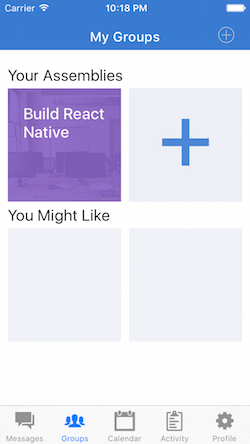
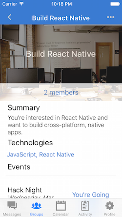

# Assemblies

#### Where Developers Connect

---

- Assemblies is an open-source mobile app built with `React Native` which developers can use to connect through 'assemblies' in their area.
- The app is the basis for a tutorial on `React Native` at [www.buildreactnative](www.buildreactnative.com) though the actual app will contain features that are not covered in the tutorial.

## Screenshots

## Contributing

- Currently, the app has room for a lot of improvements. We would like to add comprehensive testing, a Flux architecture (preferably `Redux`), and some more nuanced database querying. Feel free to post feature requests and bugs in the `issues` section. Pull requests are welcome but should be clear and easy-to-follow.

## Running locally

- Here are the steps to running the app locally on your machine.
  - `git clone http://github.com/tgoldenberg/build-react-native`
  - `cd build-react-native`
  - `npm install`
  - `open ios/assembly.xcworkspace`
  - choose which simulator you would like to use and hit the `run` button in Xcode

## Things to test and improve
  - user account creation
  - user login / logout
  - navigation between different tabs
  - creating a group
  - creating an event
  - finding available events
  - messaging other users
